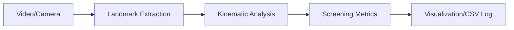

# 03. 기능 설계

## 1. 시스템 아키텍처 (System Architecture)
본 시스템은 **입력 - 처리 - 분석 - 출력**의 4단계 파이프라인으로 구성됩니다.

## 2. 주요 모듈별 상세 기능

### 1) 입력 및 전처리 모듈 (Input & Preprocessing)
*   **프레임 읽기**: OpenCV를 통한 비디오 파일 또는 실시간 웹캠 스트림 수신.
*   **이미지 최적화**: 연산 효율을 위한 리사이징 및 노이즈 제거 (Gaussian Blur 등).
*   **Face/Eye RoI 추출**: 얼굴 정면 여부를 확인하고 안구 주변 영역을 관심 영역(Region of Interest)으로 설정.

### 2) 안구 랜드마크 추출 모듈 (Landmark Extraction)
*   **Iris Tracking**: MediaPipe Face Mesh의 `refine_landmarks=True` 옵션을 사용하여 좌/우 홍채 랜드마크 추출.
*   **홍채 중심점(Anchor) 계산**:
    *   **Iris Center**: 좌/우 홍채 외곽 랜드마크 평균 좌표 $(x, y)$.
    *   **Relative Position**: 눈의 전체 가로/세로 길이 대비 중심점의 상대 위치 (눈 깜빡임 및 얼굴 움직임 보정).

### 3) 운동 역학 분석 모듈 (Kinematic Analysis)
*   **Direction (방향 분석)**:
    *   이전 프레임 대비 중심점의 이동 벡터($\Delta x, \Delta y$) 산출.
    *   8방향(상, 하, 좌, 우 및 대각선) 이동 패턴 분류.
*   **Velocity (속도 및 가속도)**:
    *   단위 시간당 이동 거리($pixel/sec$) 계산.
    *   급격한 시선 변화(Saccade)와 미세한 떨림(Nystagmus) 구분.

### 4) 스크리닝 지표 모듈 (Screening Metrics)
*   **기준값(Baseline) 설정**: 초기 N프레임(정면 응시 상태)을 통한 기준 좌표 후보 수집.
*   **운동 지표 산출**:
    *   **Displacement**: 기준 좌표 대비 홍채 중심 이동량.
    *   **Velocity**: 프레임 간 홍채 중심 이동 속도.
    *   **Relative Position**: 눈 구석 기준 상대 좌표.
*   **이상 탐지 기준 보류**: Z-Score, Moving Average Difference, Isolation Forest 등은 추후 수집 데이터와 실험 결과를 바탕으로 임계값을 정의.

### 5) 시각화 및 출력 모듈 (Visualization)
*   **Real-time Overlay**: 원본 영상 위에 홍채 중심점, 운동 궤적, 속도 지표 표시.
*   **Dashboard**: 실시간 속도/방향 그래프 출력 (Matplotlib/Streamlit).
*   **Report**: 분석 종료 후 좌표/속도 로그 및 요약 차트 생성.

## 3. 데이터 흐름 (Data Flow)
1.  **Raw Data**: Image Frame (BGR)
2.  **Intermediate 1**: Landmarks (Normalized Coordinates)
3.  **Intermediate 2**: Iris Centers, Relative Positions, Motion Vectors & Velocity (Float)
4.  **Final Output**: CSV Log, Overlay Video/Preview, Screening Metrics

## 4. 핵심 알고리즘 전략
*   **얼굴 움직임 보정**: 안구가 아닌 '머리'의 움직임으로 인한 오차를 줄이기 위해, 눈 구석(Inner/Outer Canthus)을 고정 참조점으로 사용한 상대 좌표계 적용.
*   **Smoothing**: 시계열 데이터의 미세 노이즈를 제거하기 위해 Kalman Filter 또는 Exponential Moving Average 적용 검토.
